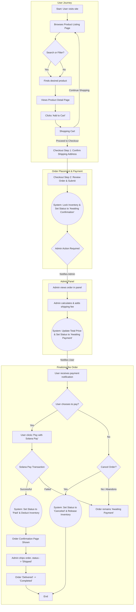

```mermaid
graph TD
    subgraph User Journey
        A[Start: User visits site] --> B(Browses Product Listing Page);
        B --> C{Search or Filter?};
        C -- Yes --> D[Finds desired product];
        C -- No --> D;
        D --> E[Views Product Detail Page];
        E --> F[Clicks 'Add to Cart'];
        F --> G[Shopping Cart];
        G -- Continue Shopping --> B;
        G -- Proceed to Checkout --> H[Checkout Step 1: Confirm Shipping Address];
    end

    subgraph Order Placement & Payment
        H --> I[Checkout Step 2: Review Order & Submit];
        I --> J((System: Lock Inventory & Set Status to 'Awaiting Confirmation'));
        J --> K{Admin Action Required};
    end

    subgraph Admin Panel
        K -- Notifies Admin --> L[Admin views order in panel];
        L --> M[Admin calculates & adds shipping fee];
        M --> N((System: Update Total Price & Set Status to 'Awaiting Payment'));
    end

    subgraph Finalizing the Order
        N -- Notifies User --> O[User receives payment notification];
        O --> P{User chooses to pay?};
        P -- Yes --> Q[User clicks 'Pay with Solana Pay'];
        Q --> R{Solana Pay Transaction};
        R -- Successful --> S((System: Set Status to 'Paid' & Deduct Inventory));
        S --> T[Order Confirmation Page Shown];
        T --> U[Admin ships order, status -> 'Shipped'];
        U --> V[Order 'Delivered' -> 'Completed'];
        V --> W[End];

        P -- No --> X{Cancel Order?};
        X -- Yes --> Y((System: Set Status to 'Canceled' & Release Inventory));
        Y --> W;
        X -- No / Abandons --> Z[Order remains 'Awaiting Payment'];
        R -- Failed --> Z;
    end
```